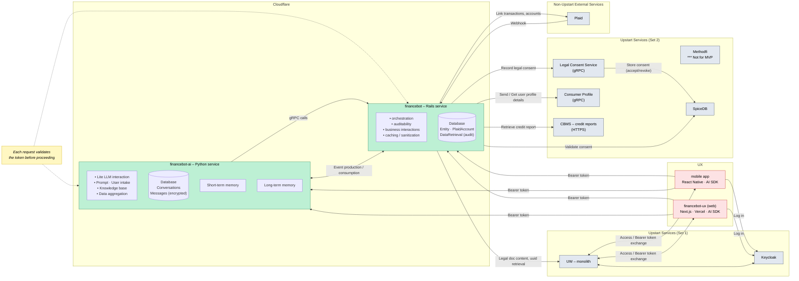

# Financebot — Architecture

End-to-end view of the financebot feature: web + mobile clients, the Rails orchestrator, the Python AI service, internal Upstart services, and external integrations.

```mermaid
flowchart LR
  %% ===== UX =====
  subgraph UX["UX"]
    Web["financebot-ux (web)<br/>Next.js · Vercel · AI SDK"]
    Mobile["mobile app<br/>React Native · AI SDK"]
  end

  %% ===== Upstart Services Set 1 =====
  subgraph Set1["Upstart Services (Set 1)"]
    Keycloak["Keycloak"]
    UW["UW – monolith"]
  end

  %% ===== Cloudflare boundary =====
  subgraph CF["Cloudflare"]
    direction TB
    subgraph Rails["financebot – Rails service"]
      RailsNotes["• orchestration<br/>• auditability<br/>• business interactions<br/>• caching / sanitization"]
      RailsDB[("Database<br/>Entity · PlaidAccount<br/>DataRetrieval (audit)")]
    end
    subgraph Py["financebot-ai – Python service"]
      PyNotes["• Lite LLM interaction<br/>• Prompt · User intake<br/>• Knowledge base<br/>• Data aggregation"]
      PyDB[("Database<br/>Conversations<br/>Messages (encrypted)")]
      STM["Short-term memory"]
      LTM["Long-term memory"]
    end
  end

  %% ===== Upstart Services Set 2 =====
  subgraph Set2["Upstart Services (Set 2)"]
    LegalConsent["Legal Consent Service<br/>(gRPC)"]
    Methodfi["Methodfi<br/>*** Not for MVP"]
    ConsumerProfile["Consumer Profile<br/>(gRPC)"]
    SpiceDB["SpiceDB"]
    CBMS["CBMS – credit reports<br/>(HTTPS)"]
  end

  %% ===== External =====
  subgraph Ext["Non-Upstart External Services"]
    Plaid["Plaid"]
  end

  %% ===== Auth / token flow =====
  Mobile -- "Log in" --> Keycloak
  Web -- "Log in" --> Keycloak
  UW <-- "Access / Bearer token exchange" --> Web
  UW <-- "Access / Bearer token exchange" --> Mobile
  Keycloak <--> UW

  %% ===== Request flow into Cloudflare =====
  Web -- "Bearer token" --> Rails
  Mobile -- "Bearer token" --> Rails
  Web -- "Bearer token" --> Py
  Mobile -- "Bearer token" --> Py
  Note["Each request validates<br/>the token before proceeding"]:::note
  Note -.-> Rails
  Note -.-> Py

  %% ===== Rails ↔ Python =====
  Py -- "gRPC calls" --> Rails
  Rails <-- "Event production / consumption" --> Py

  %% ===== Rails ↔ Set 1 =====
  Rails -- "Legal doc content, uuid retrieval" --> UW

  %% ===== Rails ↔ Set 2 =====
  Rails -- "Record legal consent" --> LegalConsent
  LegalConsent -- "Store consent (accept/revoke)" --> SpiceDB
  Rails -- "Validate consent" --> SpiceDB
  Rails -- "Send / Get user profile details" --> ConsumerProfile
  Rails -- "Retrieve credit report" --> CBMS

  %% ===== Plaid =====
  Rails -- "Link transactions, accounts" --> Plaid
  Plaid -- "Webhook" --> Rails

  classDef note fill:#fff7c2,stroke:#d4b106,color:#000,font-style:italic
  classDef svc fill:#bdf0d4,stroke:#2f855a,color:#000
  classDef ux fill:#fde2e4,stroke:#c53030,color:#000
  classDef ext fill:#e2e8f0,stroke:#4a5568,color:#000

  class Rails,Py svc
  class Web,Mobile ux
  class Keycloak,UW,LegalConsent,Methodfi,ConsumerProfile,SpiceDB,CBMS,Plaid ext
```
