# Financebot — Threat Model View

Architecture annotated with trust zones, control state, and the top threats from the security review.

Legend: ✅ control present · ⚠️ weak / partial · ❌ missing · ❓ unknown

```mermaid
flowchart LR
  %% ===================== TRUST ZONES =====================
  subgraph ZUser["🌐 Untrusted: User Devices"]
    Web["financebot-ux\nNext.js · Vercel\n✅ CORS → upstart.com only\n⚠️ LLM markdown rendered unsanitized"]
    Mobile["mobile app\nReact Native\n❌ no cert pinning\n❌ no jailbreak/root detection\n⚠️ LLM markdown rendered unsanitized"]
  end

  subgraph ZEdge["🟡 Edge"]
    CF["Cloudflare"]
  end

  subgraph ZApp["🟢 App tier (upstart_internal)"]
    Rails["financebot – Rails\n✅ JWT auth on all HTTP\n✅ entity_uuid from token claims only\n✅ verify_permission_check_performed\n❌ gRPC server: NO auth interceptors\n⚠️ AccessControl#privileged? = true (stub)\n⚠️ SpiceDB wired but not enforced"]
    Py["financebot-ai – Python\n✅ JWT verify on all HTTP\n⚠️ introspection optional\n⚠️ FINANCEBOT_AUTH_ENABLED=false foot-gun\n⚠️ detection_context → system prompt unescaped\n❌ LLM tools: no per-call authz"]
    RailsDB[("Rails DB\nEntity · PlaidAccount\nDataRetrieval audit\n🔒 LFN/KMS field encryption")]
    PyDB[("Python DB\nConversations · Messages\n🔒 KMS-encrypted")]
    Memory["3rd-party memory stores\nShort-term + Long-term\n❓ retention/deletion unknown\n❓ DPA coverage unknown"]
  end

  subgraph ZIdent["🔵 Identity"]
    Keycloak["Keycloak\n✅ OIDC/JWT issuer"]
    UW["UW – monolith\nLegal doc content\nuuid retrieval"]
  end

  subgraph ZSensitive["🔴 Sensitive internal services"]
    LegalConsent["Legal Consent\ngRPC\n✅ consent gate before data access"]
    SpiceDB["SpiceDB\n✅ consent stored\n❌ not enforced as resource gate"]
    ConsumerProfile["Consumer Profile\ngRPC\n📋 PII: name · email · phone"]
    CBMS["CBMS · HTTPS\n💳 Full bureau credit reports\n❓ auth method unknown"]
  end

  subgraph ZExt["⚫ third_party"]
    Plaid["Plaid\n✅ ES256 webhook sig verified\n🏦 balances · transactions · accounts"]
    LLM["LiteLLM → Claude Sonnet\n⚠️ Plaid data in prompts: plaintext\n❓ SaaS vs internal-hosted unclear"]
  end

  %% ===================== AUTH FLOWS =====================
  Web -->|"Log in"| Keycloak
  Mobile -->|"Log in"| Keycloak
  Keycloak <-->|"token exchange"| UW
  UW <-->|"Access/Bearer token"| Web
  UW <-->|"Access/Bearer token"| Mobile

  %% ===================== REQUEST FLOWS =====================
  Web -->|"Bearer · HTTPS"| CF
  Mobile -->|"Bearer · HTTPS\n(no cert pinning)"| CF
  CF --> Rails
  CF --> Py

  %% ===================== INTERNAL SERVICE FLOWS =====================
  Py ==>|"gRPC · ❌ UNAUTHENTICATED"| Rails
  Rails <-->|"events · Kafka"| Py
  Py -->|"prompt + Plaid data ⚠️"| LLM
  Py --> Memory
  Py --> PyDB
  Rails --> RailsDB

  Rails -->|"consent check"| SpiceDB
  Rails -->|"record consent"| LegalConsent
  LegalConsent -->|"store"| SpiceDB
  Rails -->|"legal docs"| UW
  Rails -->|"PII fetch"| ConsumerProfile
  Rails -->|"credit pull"| CBMS
  Rails -->|"link accounts"| Plaid
  Plaid -.->|"webhook ✅ sig verified"| Rails

  %% ===================== THREATS =====================
  T1["🔥 T1 · HIGH\nUnauthenticated gRPC server\nAny internal-network caller\ncan query any entity_uuid\n→ bulk credit/Plaid data exfil"]:::threat
  T2["🔥 T2 · HIGH\nToken compromise = full account access\nStubbed privileged? + optional introspection\n+ AUTH_ENABLED=false foot-gun\n→ no defense-in-depth after auth"]:::threat
  T3["🔥 T3 · HIGH\nLLM channel weaponization\ndetection_context → system prompt unescaped\nTools run w/o per-call authz\nMarkdown rendered unsanitized\n→ tool abuse + borrower phishing"]:::threat

  T1 -.->|"targets"| Rails
  T2 -.->|"targets"| Rails
  T2 -.->|"targets"| Py
  T3 -.->|"targets"| Py
  T3 -.->|"phishing channel"| Web
  T3 -.->|"phishing channel"| Mobile

  %% ===================== RECOMMENDATIONS =====================
  R1["✏️ R1 · HIGH\nAdd auth interceptors to gRPC server\nmTLS or service JWT\nNetworkPolicy to restrict callers"]:::rec
  R2["✏️ R2 · HIGH\nReplace stubbed privileged?\nEnforce SpiceDB as resource gate\nper entity × resource × consent"]:::rec
  R3["✏️ R3 · HIGH\nSandbox LLM tools\nRe-verify entity_uuid per tool call\nAllowlist markdown on render\nDelimit user input in prompt"]:::rec
  R4["✏️ R4 · HIGH\nRemove FINANCEBOT_AUTH_ENABLED=false\nfrom prod builds\nMake token introspection mandatory"]:::rec
  R5["✏️ R5 · MEDIUM\nMask financial data to LiteLLM\nDocument + constrain memory stores\nConfirm DPA coverage"]:::rec

  R1 -.->|"mitigates"| T1
  R2 -.->|"mitigates"| T2
  R3 -.->|"mitigates"| T3
  R4 -.->|"mitigates"| T2
  R5 -.->|"mitigates"| T3

  %% ===================== STYLES =====================
  classDef threat fill:#fee2e2,stroke:#b91c1c,color:#7f1d1d,font-weight:bold
  classDef rec fill:#fffbeb,stroke:#b45309,color:#78350f,font-weight:bold
  classDef user fill:#fde2e4,stroke:#c53030,color:#000
  classDef edge fill:#fef3c7,stroke:#b45309,color:#000
  classDef app fill:#d1fae5,stroke:#065f46,color:#000
  classDef ident fill:#dbeafe,stroke:#1d4ed8,color:#000
  classDef sens fill:#fecaca,stroke:#b91c1c,color:#000
  classDef ext fill:#e2e8f0,stroke:#4a5568,color:#000

  class Web,Mobile user
  class CF edge
  class Rails,Py,RailsDB,PyDB,Memory app
  class Keycloak,UW ident
  class LegalConsent,SpiceDB,ConsumerProfile,CBMS sens
  class Plaid,LLM ext
```

## Threats

| ID | Severity | Component | Description |
|----|----------|-----------|-------------|
| T1 | HIGH | financebot Rails gRPC server | `bin/grpc_server` disables all auth interceptors. Any internal-network process can call it with an arbitrary `entity_uuid` and receive Plaid accounts, transactions, and credit-report data without a token. Enables bulk cross-user exfiltration. |
| T2 | HIGH | Rails authz + financebot-ai auth config | `Authorization::AccessControl#privileged?` is stubbed to return `true`; SpiceDB is not enforced as a resource gate; token introspection is optional; `FINANCEBOT_AUTH_ENABLED=false` disables all auth in financebot-ai if set. A stolen token — or that single env flag — yields full account access with no backstop. |
| T3 | HIGH | financebot-ai LLM pipeline + web/mobile render | Borrower-controlled `detection_context` lands unescaped in the LLM system prompt. Agent tools (fetch accounts, recategorize) execute without re-verifying entity ownership per call. LLM markdown output is rendered unsanitized on web and mobile, making the assistant a live phishing channel. |

## Security Recommendations

| ID | Severity | Mitigates | Action |
|----|----------|-----------|--------|
| R1 | HIGH | T1 | Add mTLS or service-JWT interceptors to `bin/grpc_server`; add a NetworkPolicy restricting callers to financebot-ai only. |
| R2 | HIGH | T2 | Replace `AccessControl#privileged?` stub with a real SpiceDB check per entity × resource × consent; enforce SpiceDB as a mandatory resource gate on every data-access path. |
| R3 | HIGH | T3 | Re-verify `entity_uuid` inside every LLM tool call; wrap user input in an instruction-immune delimiter in the system prompt; run LLM output through an allowlist markdown sanitizer before rendering on web and mobile. |
| R4 | HIGH | T2 | Remove `FINANCEBOT_AUTH_ENABLED=false` from production-reachable code paths (compile-out or fail-closed on startup); make token introspection mandatory in production. |
| R5 | MEDIUM | T3 | Mask account numbers and balance values before sending to LiteLLM; document and contractually constrain what the third-party short/long-term memory stores persist, their retention policy, and confirm DPA coverage before borrower launch. |
