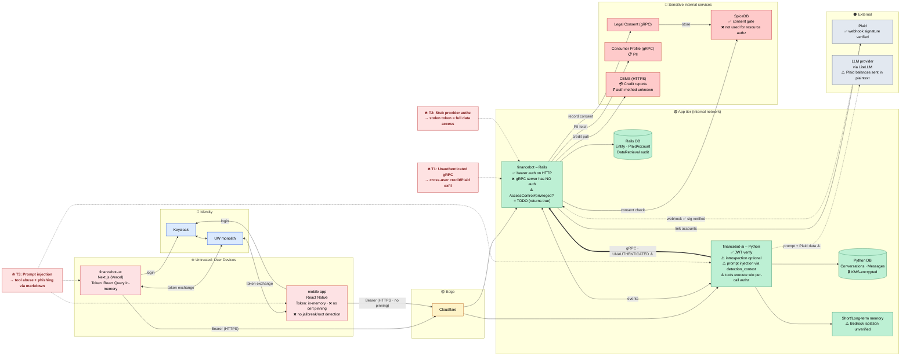

# Financebot — Threat Model View

Same architecture, annotated with trust zones, control state, and the top threats from the security review.

Legend: ✅ control present · ⚠️ weak / partial · ❌ missing · ❓ unknown

## Top threats

1. **Unauthenticated inbound gRPC on the Rails service** — `bin/grpc_server` disables default interceptors; any caller on the internal network can fetch credit reports / Plaid data for arbitrary `entity_uuid`.
2. **Stubbed provider-level authorization** — `Authorization::AccessControl#privileged?` returns `true`; a stolen token has full provider access for its bound entity, with no record-level defense-in-depth.
3. **Prompt injection via `detection_context`** — unescaped user input lands in the LLM system prompt; tools execute without per-call authorization; unsanitized markdown rendering on web + mobile turns the assistant output into a phishing channel.
